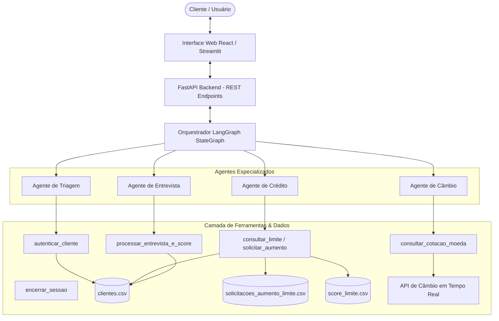

# 🏦 Banco Ágil - Sistema de Atendimento Bancário Inteligente

Sistema de atendimento ao cliente multiespecialista baseado em inteligência artificial desenvolvido para o **Banco Ágil**. A solução orquestra agentes autônomos com escopos de atuação bem delimitados, utilizando **LangChain**, **LangGraph**, **Google Gemini** (`langchain-google-genai`), backend de alta performance em **FastAPI** e uma interface web moderna e reativa em **React**.

---

## 1. 📌 Visão Geral do Projeto

O **Banco Ágil** automatiza o ciclo completo de atendimento bancário digital através de agentes cognitivos especializados. Cada agente opera estritamente dentro de seu domínio funcional, interagindo de forma coordenada e fluida com o cliente por meio de transições implícitas (o usuário percebe um único assistente bancário com múltiplas competências).

### Agentes Especializados do Sistema:
- 🛡️ **Agente de Triagem**: Porta de entrada e segurança, responsável por recepcionar o usuário, autenticar credenciais contra a base cadastral com tolerância a 3 tentativas e direcionar a demanda para o especialista competente.
- 💳 **Agente de Crédito**: Especialista em crédito que consulta limites vigentes, recebe pedidos de aumento de limite, valida a elegibilidade do pedido contra a matriz de score do banco e registra os pedidos formais.
- 📝 **Agente de Entrevista de Crédito**: Conduz entrevistas financeiras conversacionais estruturadas para coletar dados socioeconômicos e recalcular o score de crédito do cliente com base em fórmula matemática ponderada.
- 💱 **Agente de Câmbio**: Fornece cotações de moedas estrangeiras (Dólar, Euro, Bitcoin, Libra, etc.) em tempo real via integração com APIs externas.

---

## 2. 🏗️ Arquitetura do Sistema

A arquitetura do projeto foi estruturada em camadas independentes, garantindo desacoplamento, rastreabilidade, persistência segura em arquivos CSV e suporte a execuções concorrentes:



### Fluxo de Manipulação de Dados:
1. **Autenticação & Triagem**: Os dados de entrada (CPF e Data de Nascimento) são normalizados (limpeza de caracteres não numéricos e padronização de datas) e validados contra `data/clientes.csv`.
2. **Avaliação de Crédito**: Solicitações de aumento de limite são registradas formalmente em `data/solicitacoes_aumento_limite.csv` (`cpf_cliente`, `data_hora_solicitacao` em ISO 8601, `limite_atual`, `novo_limite_solicitado`, `status_pedido`). A aprovação/rejeição consulta as faixas de score em `data/score_limite.csv`.
3. **Recálculo de Score**: A entrevista financeira aplica a fórmula ponderada e atualiza o campo `score_credito` do cliente no arquivo `data/clientes.csv`.

---

## 3. 🚀 Funcionalidades Implementadas

- **Autenticação Resiliente**: Sanitização de CPF e parsing flexível de datas (`DD/MM/AAAA`, `AAAA-MM-DD`, `DD-MM-AAAA`). Bloqueio e encerramento cordial após 3 falhas consecutivas.
- **Roteamento Implícito Multiagente**: Transição transparente de agentes durante o diálogo (ex.: do Crédito para Entrevista e de volta ao Crédito).
- **Cálculo de Score Ponderado**:
  $$\text{Score} = \left(\frac{\text{renda}}{\text{despesas} + 1}\right) \times 30 + \text{peso\_emprego} + \text{peso\_dependentes} + \text{peso\_dividas}$$
  *(Resultado limitado deterministicamente entre 0 e 1000 pontos)*.
- **Cotações de Câmbio em Tempo Real**: Consulta dinâmica à AwesomeAPI com cotação de compra, venda, variação percentual diária e timestamp, com fallback resiliente.
- **Encerramento Global Controlado**: Suporte a ferramenta de encerramento (`encerrar_sessao_atendimento`) a qualquer instante da conversa.
- **Interface Web React Premium**: Chat em tempo real com identificador de agente ativo, painel com dados da conta do cliente autenticado e **inspetor ao vivo dos arquivos CSV** com botão de teste rápido.
- **Interface Alternativa Streamlit**: Interface simplificada em Streamlit para demonstrações rápidas.

---

## 4. 💡 Desafios Enfrentados e Soluções

| Desafio | Causa Raiz | Solução Adotada |
| :--- | :--- | :--- |
| **Transições Implícitas de Agentes** | O LLM pode perder o contexto ou exibir mensagens técnicas de transição. | Implementação de um `StateGraph` (LangGraph) com injeção dinâmica de contexto cadastral e detecção supervisionada de intenções de roteamento. |
| **Variação de Formatos de CPF e Data** | Usuários informam datas e CPFs com formatos diversos (`12345678900`, `123.456.789-00`, `15/05/1990`, `1990-05-15`). | Módulo utilitário `parse_date` e `clean_cpf` que normaliza múltiplos formatos antes de qualquer consulta ao banco de dados. |
| **Concorrência e Integridade de CSV** | Múltiplas requisições simultâneas lendo/escrevendo arquivos CSV podem gerar conflitos de I/O. | Implementação de bloqueio de concorrência (`threading.Lock`) no `CSVManager`, garantindo atomicidade nas operações. |
| **Disponibilidade da API de Câmbio** | Falhas de rede ou rate limits em APIs externas de cotação. | Criação de timeout curto (6s) e fallback automático com dados referenciais claros e aviso transparente ao usuário. |
| **Ambiente sem Node.js Local** | Execução de frontends modernos sem necessidade de gerenciar `npm`/`node`. | Arquitetura SPA React 18 moderna servida nativamente pelo FastAPI via CDN e Babel Standalone, sem complexidade de build. |

---

## 5. 🛠️ Escolhas Técnicas e Justificativas

- **Python 3.11 + FastAPI**: Escolhido pela alta performance assíncrona, documentação automática OpenAPI/Swagger e facilidade de integração com bibliotecas de IA.
- **LangChain + LangGraph**: Padrão da indústria para desenvolvimento de sistemas multiagente com grafos de estado, permitindo controle fino do ciclo de vida, memória conversacional e chamada de ferramentas (*Tool Calling*).
- **Google Gemini API (`langchain-google-genai`)**: Modelo de linguagem de última geração (`gemini-2.5-flash` / `gemini-1.5-flash`), oferecendo alta velocidade de resposta, suporte nativo a function calling e excelente custo-benefício.
- **Pandas + CSV Manager Tipado**: Utilização de `pandas` e `pydantic` para garantir validação estrita de esquemas e persistência consistente dos arquivos CSV requeridos pelo desafio.
- **React 18 Single-Page Application**: Interface rica com feedback visual instantâneo, visualizador de CSVs em tempo real e experiência de banco digital.

---

## 6. 📖 Tutorial de Execução e Testes

### Pré-requisitos
- Python 3.10 ou superior instalado.
- Chave de API do Google Gemini ([Google AI Studio](https://aistudio.google.com/)).

### Passo 1: Clonar o Repositório e Instalar Dependências
```bash
git clone https://github.com/Joao-Madeiro/desafio-agente-bancario-inteligente.git
cd desafio-agente-bancario-inteligente

# Instalação das dependências
pip install -r requirements.txt
```

### Passo 2: Configurar Variáveis de Ambiente
Crie um arquivo `.env` na raiz do projeto baseado no `.env.example`:
```env
GOOGLE_API_KEY=sua_chave_gemini_aqui
GEMINI_MODEL=gemini-2.5-flash
HOST=127.0.0.1
PORT=8000
```

### Passo 3: Executar a Aplicação Principal (FastAPI + React UI)
```bash
python run.py
```
Acesse no navegador:
- **Interface Web do Banco Ágil**: [http://127.0.0.1:8000/](http://127.0.0.1:8000/)
- **Documentação da API (Swagger)**: [http://127.0.0.1:8000/docs](http://127.0.0.1:8000/docs)

### Passo 4 (Opcional): Executar via Streamlit
```bash
streamlit run app_streamlit.py
```

### Passo 5: Executar os Testes Automatizados
Para rodar toda a suíte de testes com cobertura completa:
```bash
pytest tests/ -v
```

---

## 👥 Clientes de Teste Pré-cadastrados

| Nome | CPF | Data de Nascimento | Limite Atual | Score | Cenário de Teste |
| :--- | :--- | :--- | :--- | :--- | :--- |
| **Ana Silva** | `12345678900` | `15/05/1990` | R$ 2.500,00 | 450 pts | Teste de aumento de limite intermediário e entrevista |
| **Carlos Souza** | `98765432111` | `22/10/1985` | R$ 12.000,00 | 820 pts | Score alto: Aprovação de limites elevados até R$ 50k |
| **Mariana Oliveira** | `11122233344` | `03/01/1998` | R$ 800,00 | 210 pts | Score inicial baixo: Rejeição de limite $\rightarrow$ Redirecionamento para Entrevista |
| **Roberto Santos** | `55566677788` | `19/12/1978` | R$ 4.000,00 | 580 pts | Teste de consultas de câmbio e crédito |

---

## 👨‍💻 Autor
**João Madeiro**
