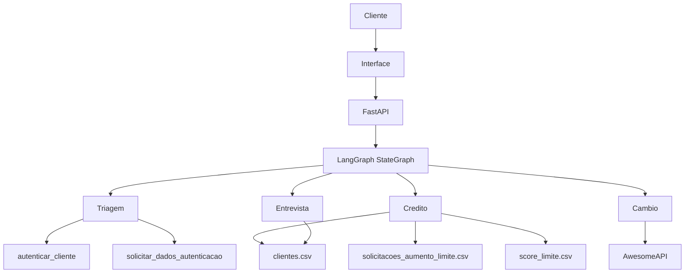

# Madeiro Bank

Sistema de atendimento bancário multiespecialista com agentes de IA, desenvolvido para o desafio técnico de Agentes de IA. A aplicação usa Google Gemini com tool calling, LangGraph para orquestração, FastAPI como backend e uma interface React servida pelo próprio backend. Também há uma interface alternativa em Streamlit.

## Visão Geral do Projeto

O Madeiro Bank simula o atendimento de um banco digital. O cliente conversa com um único assistente, enquanto o sistema encaminha internamente cada solicitação para o agente adequado.

Agentes disponíveis:

- **Triagem**: autentica o cliente e identifica a necessidade.
- **Crédito**: consulta limite e processa pedidos de aumento.
- **Entrevista de Crédito**: coleta dados financeiros e recalcula o score.
- **Câmbio**: consulta cotações de moedas em uma API externa.

## Arquitetura do Sistema



### Fluxo de Atendimento

1. O cliente envia a primeira mensagem pelo chat.
2. A Triagem solicita autenticação por tool call.
3. A interface exibe um botão no chat. O modal de CPF e data de nascimento só abre após o clique.
4. Os dados preenchidos são enviados à conversa e a Triagem chama `autenticar_cliente`.
5. Após a autenticação, a solicitação é encaminhada internamente ao agente responsável.
6. As trocas entre agentes não geram novas saudações, mensagens técnicas ou banners de transferência.
7. O cliente pode encerrar a sessão a qualquer momento pela ferramenta `encerrar_sessao_atendimento`.

### Dados

- `data/clientes.csv`: cadastro, limite, score e dados de contato dos clientes.
- `data/score_limite.csv`: faixas de score e limite máximo permitido.
- `data/solicitacoes_aumento_limite.csv`: solicitações de aumento com as colunas `cpf_cliente`, `data_hora_solicitacao`, `limite_atual`, `novo_limite_solicitado` e `status_pedido` (`pendente`, `aprovado` ou `rejeitado`), usando timestamp UTC.
- As operações de escrita usam `threading.Lock` para evitar conflitos entre requisições.

## Funcionalidades Implementadas

- Autenticação por CPF e data de nascimento contra `clientes.csv`.
- Normalização de CPF, incluindo máscara e zeros à esquerda.
- Aceite de datas nos formatos `DD/MM/AAAA`, `DD-MM-AAAA`, `AAAA-MM-DD` e formato compacto.
- Até três tentativas consecutivas de autenticação; após a terceira falha, a sessão é encerrada.
- Modal de autenticação com máscaras visuais para CPF e data de nascimento.
- Consulta de limite e score do cliente autenticado.
- Solicitação formal de aumento de limite com as colunas exigidas pelo desafio.
- Aprovação ou rejeição conforme `score_limite.csv`.
- Entrevista com renda, emprego, despesas, dependentes e dívidas.
- Recálculo de score entre 0 e 1000 e atualização de `clientes.csv`. A fórmula usa `(renda / (despesas + 1)) * 30`, somada aos pesos de emprego, dependentes e dívidas.
- Retorno automático à análise de crédito após a entrevista.
- Cotação de USD, EUR, GBP, BTC e outras moedas pela AwesomeAPI, com fallback referencial.
- Encerramento global por tool call.
- Interface React com tema claro e escuro, toggle de sugestões rápidas e efeito de digitação nas respostas.
- Interface Streamlit para demonstração alternativa.
- Endpoints de saúde, chat, reset, clientes, solicitações, regras de score e cotações.

## Desafios Enfrentados e Como Foram Resolvidos

| Desafio | Solução |
| --- | --- |
| Manter uma conversa única entre agentes | Estado compartilhado no LangGraph e roteamento interno sem mensagens de transferência. |
| Evitar chamadas de ferramentas incompatíveis com o Gemini | Histórico sanitizado e resultados de tools reapresentados como contexto textual interno. |
| Autenticação com diferentes formatos de entrada | Normalização de CPF e parsing de múltiplos formatos de data. |
| Persistência concorrente em CSV | Bloqueio compartilhado nas operações de leitura e escrita. |
| Falha de API de câmbio | Timeout e valores referenciais de fallback com indicação ao cliente. |
| Respostas técnicas aparecendo para o cliente | Resultados internos não são persistidos no histórico exibido. |

## Escolhas Técnicas e Justificativas

- **Python**: integração simples com IA, CSV e APIs externas.
- **LangChain**: integração com Gemini e definição das ferramentas dos agentes.
- **LangGraph**: controle explícito do estado, roteamento e ciclo de ferramentas.
- **Google Gemini**: suporte a function calling e baixa latência.
- **FastAPI**: API REST, Swagger automático e gerenciamento de sessões.
- **Pandas**: leitura, validação e persistência das tabelas CSV.
- **Pydantic**: modelos de dados e validação de payloads.
- **React 18 via CDN**: interface sem etapa de build, compatível com o servidor FastAPI.
- **Streamlit**: interface alternativa para demonstrações rápidas.

## Tutorial de Execução

### Pré-requisitos

- Python 3.10 ou superior.
- Chave da API do Google Gemini.

Crie um arquivo `.env` na raiz:

```env
GOOGLE_API_KEY=sua_chave_gemini
GEMINI_MODEL=gemini-3.5-flash-lite
HOST=127.0.0.1
PORT=8000
```

### Interface Principal

```bash
python run.py
```

Acesse:

- Interface web: `http://127.0.0.1:8000/`
- Swagger: `http://127.0.0.1:8000/docs`
- Health check: `http://127.0.0.1:8000/api/health`
- Projeto Hospedado no Vercel : https://desafio-agente-bancario-inteligente.vercel.app/
### Interface Streamlit

```bash
streamlit run app_streamlit.py
```

### Deploy no Vercel

O projeto possui `pyproject.toml` e `vercel.json` para expor `src.api.main:app` como uma função FastAPI. No painel do Vercel:

1. Importe o repositório.
2. Não configure Build Command nem Output Directory.
3. Adicione `GOOGLE_API_KEY` nas Environment Variables.
4. Opcionalmente, adicione `GEMINI_MODEL`.
5. Faça o deploy e acesse a URL gerada.

O `run.py` é usado apenas localmente. No Vercel, o FastAPI é executado como função serverless.

Limitações da demonstração no Vercel:

- Os CSVs são copiados para `/tmp`, pois o filesystem do Vercel não permite escrita persistente no bundle.
- Alterações de limite e score podem ser perdidas após uma nova instância ou novo deploy.
- As sessões ficam em memória e podem não ser compartilhadas entre instâncias.
- Para uso persistente, substitua os CSVs e o dicionário de sessões por um banco ou serviço externo.

## Estrutura do Projeto

```text
.
├── app_streamlit.py
├── data/
├── run.py
├── src/
│   ├── agents/       # prompts, estado e orquestração LangGraph
│   ├── api/          # FastAPI e interface React estática
│   ├── database/     # gerenciamento dos CSVs
│   ├── models/       # schemas Pydantic
│   └── tools/        # autenticação, crédito, entrevista, câmbio e sessão
└── README.md
```

## Conformidade com o Desafio Técnico

| Requisito | Implementação |
| --- | --- |
| Triagem com saudação, CPF e data de nascimento | Agente de Triagem e `autenticar_cliente`. |
| Validação contra `clientes.csv` | `CSVManager.validate_client`. |
| Três falhas e encerramento | Contador `auth_attempts` e `encerrar_sessao_atendimento`. |
| Consulta e aumento de limite | Agente de Crédito e `credit_tools.py`. |
| Registro CSV do pedido | `solicitacoes_aumento_limite.csv` com as cinco colunas exigidas. |
| Aprovação por score | Consulta a `score_limite.csv`. |
| Entrevista financeira | Cinco campos exigidos e cálculo ponderado. |
| Atualização e retorno ao crédito | Atualização de `clientes.csv` e transferência automática. |
| Câmbio em tempo real | AwesomeAPI com fallback controlado. |
| Encerramento em qualquer etapa | Tool disponível para todos os agentes. |
| Tratamento de erros | Validações, mensagens controladas, timeout e fallback. |
| Interface para simular atendimento | React e Streamlit. |

## Autor

João Madeiro
